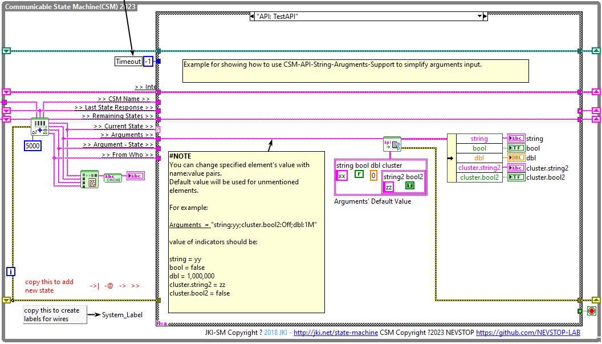

# CSM-API-String-Arguments-Support

[English](./README.md) | [中文](./README(CN).md)

[](https://www.vipm.io/package/nevstop_lib_csm_api_string_arguments_support/)
[](https://www.vipm.io/package/nevstop_lib_csm_api_string_arguments_support/)
[](https://opensource.org/licenses/Apache-2.0)
[](https://github.com/NEVSTOP-LAB/CSM-API-String-Arguments-Support/releases)

增强通信状态机（CSM）的API参数。它允许以纯文本格式包含各种数据类型，并且保证更加利于手动输入。

这个库提供了两个新的 CSM 模板, 这两个模板都包含 “Data: Get Configuration”和“Data: Set Configuration”两个内置的状态，用于访问存储在 '>> internal data >>' 移位寄存器中的配置数据。



## 支持数据类型

- 字符串(String)
- 路径(Path)
- 布尔(Boolean)
- 整数(I8,I16,I32,I64,U8,U16,U32,U64)
- 浮点数(DBL/SGL)
- 复数(DBL/SGL)
- 时间戳(Timestamp)
- 枚举(Enum)
- 数组(Array)
- 簇(Cluster)
- 其他(使用CSM-Hexstr)

### 字符串(String)/路径(Path)

字符串/路径遵循CSM的规则。'->|' '->' '-@' '-&' '>>' ',' ';' 在传递之前应该被替换为 %[Hex] 字符串。效果与使用 **CSM AdvanceAPI\CSM Make String Arguments Safe.vi** 相同。

### 布尔(Boolean)

内置的TRUE/FALSE字符串:

``` text
  - T/F
  - True/False
  - On/Off
  - Enable/Disable
  - Active/Inactive
  - valid/Invalid
  - 1/0
  - Open/Close
  - Non-null/null
```

> [!NOTE]
> 空字符串将被转换为Prototype的输入值。

> [!NOTE]
> 你可以使用 `API String - Add Boolean Strings.vi` 或 `API String - Remove Boolean Strings.vi` 来设置你自己的布尔字符串。

> [!NOTE]
> 标签-数据对(Tag:Value)可以被正确解析。标签只用于提高可读性，转换时会被忽略。

### 整数(I8,I16,I32,I64,U8,U16,U32,U64)

支持的数据格式有：普通整数，十进制，十六进制，二进制，八进制，十六进制后缀，十六进制后缀，二进制后缀，八进制后缀。举例如下：

``` text
  - 12345
  - 0d12345
  - 0x1234
  - 0b10101010
  - 0o777
  - 1234H
  - 10101010H
  - 7777O
  - 10k
  - 1M
```

> [!NOTE]
> 空字符串将被转换为Prototype的输入值。

> [!NOTE]
> 标签-数据对(Tag:Value)可以被正确解析。标签只用于提高可读性，转换时会被忽略。

### 浮点数(DBL/SGL)

支持的数据格式有：普通浮点数，科学计数法，以及特殊浮点数。举例如下：

``` text
  - 1.2345
  - 1.23E+2
  - 1.23E-2
  - 1.23Y (1.23*10^24)
  - 1.23Z (1.23*10^21)
  - 1.23E (1.23*10^18)
  - 1.23P (1.23*10^15)
  - 1.23T (1.23*10^12)
  - 1.23G (1.23*10^9)
  - 1.23M (1.23*10^6)
  - 1.23k (1.23*10^3)
  - 1.23m (1.23*0.001)
  - 1.23u (1.23*0.000001)
  - 1.23n (1.23*10^-9)
  - 1.23p (1.23*10^-12)
  - 1.23f (1.23*10^-15)
  - 1.23a (1.23*10^-18)
  - 1.23z (1.23*10^-21)
  - 1.23y (1.23*10^-24)
  - 特殊浮点数值: `e`,`-e`,`pi`,`-pi`,`inf`,`+inf`,`-inf`,`NaN`
```

> [!NOTE]
> 空字符串将被转换为Prototype的输入值。

> [!NOTE]
> 默认精度为6位有效数字. 可以通过 `API String - Set Float Precision.vi` 修改。

> [!NOTE]
> 标签-数据对(Tag:Value)可以被正确解析。标签只用于提高可读性，转换时会被忽略。

> [!NOTE]
> 带有单位的数据字符串也会被正确解析。

_**特殊情况说明**_:

- 如果浮点数字符串与单位字符串之间存在空格，则所有包含浮点数字符串后面的符号的字符串都被识别为单位字符串。

> 1.23mA : 浮点数: 1.23m; 单位: A
> 1.23 mA : 浮点数: 1.23; 单位: mA

- 对于科学计数法模式，无论是否存在空格，浮点数后面的字符串都被识别为单位字符串。

> 1.23E+5mA: 浮点数: 1.23E+5; 单位: mA
> 1.23E+5 mA: 浮点数: 1.23E+5; 单位: mA

> [!NOTE]
> `e`,`-e`,`pi`,`-pi`,`inf`,`+inf`,`-inf`,`NaN` 不支持单位。

### 复数(DBL/SGL)

`a+bi` or `a-bi` 表示复数. `a` 和 `b` 支持所有的浮点数表达方式.

> [!NOTE]
> 空字符串将被转换为Prototype的输入值。

> [!NOTE]
> 标签-数据对(Tag:Value)可以被正确解析。标签只用于提高可读性，转换时会被忽略。

### 时间戳(Timestamp)

时间戳的表达格式为：`TimeStamp_String(Format_String)`. `Format_String` 将用与解析扫描 `TimeStamp_String`.

``` text
"2023-10-11 22:54:33(%<%Y-%m-%d %H:%M:%S>T)" 等效于时间戳 "2023-10-11T14:54:33.000Z".
```

_**特殊情况说明**_:

字符串没有包含 `Format_String`时, `TimeStamp_String` 应该满足 ISO8601 UTC 标准.

``` text
"2023-10-31T14:49:39.597Z" 为有效的表达方式.
"2023-10-31T22:49:39.597+08:00" 为有效的表达方式.
```

> [!NOTE]
> 对于时间戳，空字符串将被转换为当前时间。

### 枚举(Enum)

`Indexed Enum` 定义为 [索引编号(index)][分隔符(separator)][枚举字符串] 格式的字符串。以下都是支持的表达方式：

> 普通数字作为索引编号(index), == 作为分隔符(separator)
>
> - 1 == boolean
> - 2 == string
> - 4 == dbl
> - 8 == number
>
> HEX数字作为索引编号(index), -- 作为分隔符(separator)
>
> - 0x01 -- boolean
> - 0x02 -- string
> - 0x04 -- dbl
> - 0x08 -- number
>
> 二进制数字作为索引编号(index), -- 作为分隔符(separator)
>
> - 0b0001 __ boolean
> - 0b0010 __ string
> - 0b0100 __ dbl
> - 0b1000 __ number

> [!NOTE]
> 索引编号(index)支持所有的整数表达方式。

_**转换规则1: 没有索引编号时，通过字符串匹配进行转换**_

Enum = {AAA,BBBB,CCCC}

- 字符串 "AAA" 将被转换为 Enum(AAA), Enum的数字值为 0
- 字符串 "CCC" 将被转换为 Enum(CCC), Enum的数字值为 2

_**转换规则2：在包含索引编号时，既可以通过字符串匹配转换，也可以通过索引编号(index)匹配进行转换**_

Enum = {1- AAA,5 - BBBB, 9 - CCCC}

- 字符串 "AAA" 将被转换为 Enum(1- AAA), Enum的数字值为 0
- 字符串 "5" 将被转换为 Enum(5 - BBBB), Enum的数字值为 1
- 字符串 "9 - CCCC" 将被转换为 Enum(9 - CCCC), Enum的数字值为 2

### 数组(Array)

',' 用于元素分隔符，'；' 用于行分隔符。 '[' 和 ']' 用于边界符号。 如果不是复杂的混合数据类型，'[' 和 ']'可以省略。

**举例:**

`a,b,c,d,e` 和 `[a,b,c,d,e]` 都表示一个5个元素的数组

``` text
a b c d e
```

`a;b;c;d;e` 和 `[a;b;c;d;e]` 都表示一个5个元素的数组

``` text
a
b
c
d
e
```

`a1, b1, c1, d1, e1; a2, b2, c2, d2, e2` 和 `[a1, b1, c1, d1, e1; a2, b2, c2, d2, e2]` 表示一个 2*5 的二维数组。

``` text
a1 b1 c1 d1 e1
a2 b2 c2 d2 e2
```

> [!NOTE]
> 空字符串将被转换为Prototype的输入值。

### 簇(Cluster)

**转换规则1: 标签-数据对(Tag:Value)模式**

输入字符串是一些标签-数据对(Tag:Value)，':'用于分隔标签和数据，'；'用于分隔元素。'{'和'}'用于边界符号。如果不是复杂的混合数据类型，'{'和'}'可以省略。其他规则如下：

- 标签是簇中元素的名称，值转换对应簇中元素的数据类型。
- 只需要描述发生变化的元素即可，与数据原型中一致的数据，可缺省。
- 通过名称匹配，顺序并不重要。
- 嵌套的簇，子簇的标签为簇的标签加上子簇内元素的标签，中间用'.'分隔。
- 嵌套的簇，如果子簇的标签名字唯一，可以省略父簇的标签。

**举例:**

假如一个簇的数据原型如下：

``` text
typedef cluster{
Boolean b;
String str;
U32 integer
Cluster subCluster
 {
  Boolean b2;
 }
}
```

> `b:On` 和 `{b:On}` 表示只修改 cluster's 布尔类型数据 b 为 TRUE. 其他两个元素的值与Prototype的输入值一致。
>
> `b:On;str:abcdef` 和 `{b:On;str:abcdef}` 表示修改 cluster's 布尔类型数据 b 为 TRUE 和 String 类型数据 str 为 "abcdef". 其他元素的值与Prototype的输入值一致。
>
> `{subCluster.b2:On}` 表示修改 cluster's 子簇的布尔类型数据 b2 为 TRUE. 其他元素的值与Prototype的输入值一致。由于b2是唯一的，可以省略父簇的标签。`b2:On` 也表示相同的转换。

**转换规则2: 无标签模式**

在这种情况下，输入字符串是一组值。这些值由分号分隔。

- 顺序非常重要，元素的顺序很重要。第一个元素将设置为簇的第一个元素，第二个元素将设置为簇的第二个元素，依此类推。
- 如果输入字符串的元素少于簇的元素，则剩余的元素将保持不变。
- 如果输入字符串的元素多于簇的元素，则多余的元素将被忽略。


> `on;abcdef;13` 和 `{on;abcdef;13}` 表示将簇的 b 更改为 TRUE 和 str 更改为 "abcdef"，U32整数更改为 13。如果簇有更多元素，它们将保持不变。
>
> `on;abcdef` 和 `{on;abcdef}` 表示将簇的 b 更改为 TRUE 和 str 更改为 "abcdef"。其他元素的值与Prototype的输入值一致。

> [!NOTE]
> 空字符串将被转换为Prototype的输入值。

### 其他(使用CSM-Hexstr)

其他数据类型将被先转换为变体(Variant)，并使用CSM-HexStr表示。
