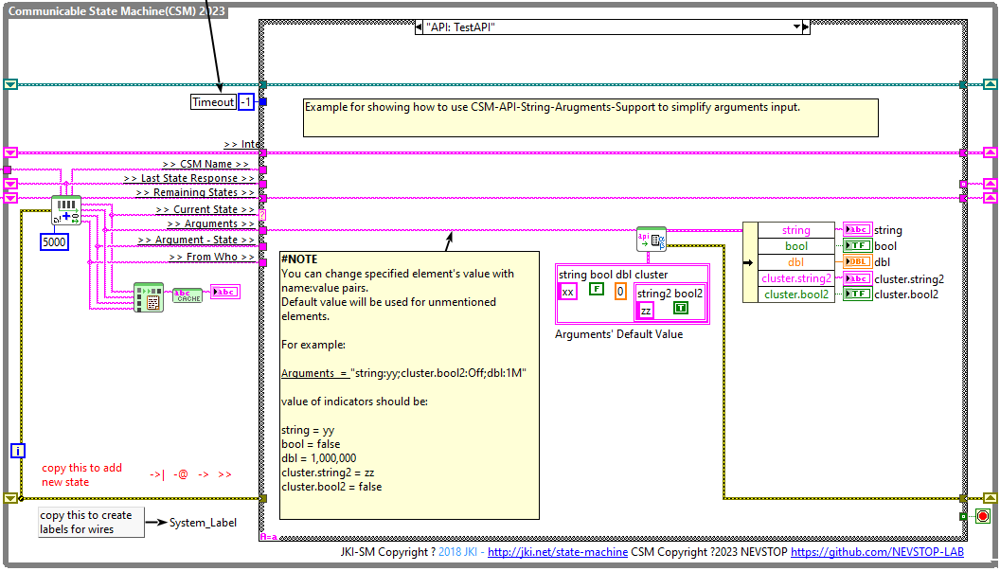

# CSM-API-String-Arguments-Support

[English](./README.md) | [中文](./README(CN).md)

[](https://www.vipm.io/package/nevstop_lib_csm_api_string_arguments_support/)
[](https://www.vipm.io/package/nevstop_lib_csm_api_string_arguments_support/)
[](https://github.com/NEVSTOP-LAB/CSM-API-String-Arguments-Support/releases)

This library enhances the API parameters for the Communicable State Machine (CSM) framework by enabling the inclusion of various data types in plain text format.

The library also provides two additional templates that include "Data: Get Configuration", "Data: Set Configuration", and "Data: Get Internal Data" states. These templates serve as a starting point for building CSM modules with the ability to access data stored in the '>> internal data >>' shift register.



## Supported Data Types

- String
- Path
- Tag
- Refnum (IVI/VISA/UserDefinedRefnumTag)
- Boolean
- Integer (I8,I16,I32,I64,U8,U16,U32,U64)
- Float (DBL/SGL)
- Complex (DBL/SGL)
- Timestamp
- Enum
- Array
- Cluster
- Other (using CSM-Hexstr)

### String/Path/Refnum(IVI/VISA/UserDefinedRefnumTag)/Tag

For String/Path data types, CSM keywords like '->|', '->', '-@', '-&', '>>', ',', and ';' are automatically replaced with %[Hex] strings before passing, similar to how **CSM AdvanceAPI\CSM Make String Arguments Safe.vi** works.

> [!NOTE]
> Refnum(IVI/VISA/UserDefinedRefnumTag) and Tag are also supported, following the same rules as the String type.

### Boolean

Predefined TRUE/FALSE String Pairs:

```text
TRUE/FALSE String Pairs:
  - T/F
  - True/False
  - On/Off
  - Enable/Disable
  - Active/Inactive
  - valid/Invalid
  - 1/0
  - Open/Close
  - Non-null/null
```

> [!NOTE]
> For Boolean values, an empty string will be converted to the input prototype value

> [!NOTE]
> Use `API String - Add Boolean Strings.vi` or `API String - Remove Boolean Strings.vi` to customize your own boolean string pairs.

> [!NOTE]
> Tag-value pairs (Tag:Value) can be parsed correctly. Tags improve readability and are ignored during conversion.

### Integer

Supported formats: Normal, Hex, Binary, Octal, Hex with suffix H, Octal with suffix O, Binary with suffix B, Decimal with suffix D. Examples:

```text
  - 12345
  - 0d12345
  - 0x1234
  - 0b10101010
  - 0o777
  - 1234H
  - 10101010H
  - 7777O
  - 10k
  - 1M
```

> [!NOTE]
> For Integer values, an empty string will be converted to the input prototype value

> [!NOTE]
> Tag-value pair(Tag:Value) could be parsed correctly. Tag is used for readability and will be ignored during conversion.

### Float(DBL/SGL)

Supported formats: Normal Float, Scientific Notation, Special Float. Examples:

```text
  - 1.2345
  - 1.23E+2
  - 1.23E-2
  - 1.23Y (1.23×10^24)
  - 1.23Z (1.23×10^21)
  - 1.23E (1.23×10^18)
  - 1.23P (1.23×10^15)
  - 1.23T (1.23×10^12)
  - 1.23G (1.23×10^9)
  - 1.23M (1.23×10^6)
  - 1.23k (1.23×10^3)
  - 1.23m (1.23×0.001)
  - 1.23u (1.23×0.000001)
  - 1.23n (1.23×10^-9)
  - 1.23p (1.23×10^-12)
  - 1.23f (1.23×10^-15)
  - 1.23a (1.23×10^-18)
  - 1.23z (1.23×10^-21)
  - 1.23y (1.23×10^-24)
  - Special Float: `e`,`-e`,`pi`,`-pi`,`inf`,`+inf`,`-inf`,`NaN`
```

> [!NOTE]
> For Float values, an empty string will be converted to the input prototype value.

> [!NOTE]
> Default precision is 6 decimal places. You can change it using `API String - Set Float Precision.vi`.

> [!NOTE]
> Tag-value pairs can be parsed correctly. Tags improve readability and are ignored during conversion.

> [!NOTE]
> Float strings with units are also supported.

_**Special Cases**_:

- If there is a `space` between the float string and unit string, all text following the float string (including notation) is recognized as the unit string.

> 1.23mA : Float: 1.23m; Unit: A
> 1.23 mA : Float: 1.23; Unit: mA

- In scientific notation mode, any string following the float string is recognized as the unit string, regardless of spaces.

> 1.23E+5mA: Float: 1.23E+5; Unit: mA
> 1.23E+5 mA: Float: 1.23E+5; Unit: mA

> [!NOTE]
> Units are not supported for special float values like `e`,`-e`,`pi`,`-pi`,`inf`,`+inf`,`-inf`, and `NaN`.

### Complex(DBL/SGL)

`a+bi` or `a-bi` represents complex data types. Both `a` and `b` support all Float formats described above.

> [!NOTE]
> For Complex values, an empty string will be converted to the input prototype value

> [!NOTE]
> Tag-value pair could be parsed correctly. Tag is used for readability and will be ignored during conversion.

### Timestamp

Timestamp strings use the format `TimeStamp_String(Format_String)`. The `Format_String` is used to parse the `TimeStamp_String`.

```text
"2023-10-11 22:54:33(%<%Y-%m-%d %H:%M:%S>T)" equals the UTC timestamp string "2023-10-11T14:54:33.000Z".
```

_**Special Case**_:

If no time string format is included, the RFC3339 standard is used by default.

```text
"2023-10-31T14:49:39.597Z" is valid.
"2023-10-31T22:49:39.597+08:00" is valid.
```

`TimeStamp String(FormatString)` is also supported. The `FormatString` enclosed in quotes will be used to parse the `TimeStamp String`.

> [!NOTE]
> For Timestamp values, an empty string will be converted to the current time.

### Enum

Indexed Enum is defined as Enum strings composed of [number] [separator] [enum string]. The following expressions are supported:

> Hexadecimal number with "--" as separator:
>
> - 0x01 -- boolean
> - 0x02 -- string
> - 0x04 -- dbl
> - 0x08 -- number
>
> Binary number with "__" as separator:
>
> - 0b0001 __ boolean
> - 0b0010 __ string
> - 0b0100 __ dbl
> - 0b1000 __ number
>
> Decimal number with "==" as separator:
>
> - 1 == boolean
> - 2 == string
> - 4 == dbl
> - 8 == number

> [!NOTE]
> Index numbers support all integer expressions mentioned earlier.


_**Rule 1: When No Index is Specified**_

When no index is specified, the string is converted to an Enum by matching the string itself.

Example: Enum = {AAA, BBBB, CCCC}

- String "AAA" converts to Enum(AAA), IntegerValue = 0
- String "CCC" converts to Enum(CCC), IntegerValue = 2

_**Rule 2: When Index is Specified**_

When an index is specified, the string can be converted to an Enum by matching either the string or the index.

Example: Enum = {1- AAA, 5 - BBBB, 9 - CCCC}

- String "AAA" converts to Enum(1- AAA), IntegerValue = 0
- String "5" converts to Enum(5 - BBBB), IntegerValue = 1
- String "9 - CCCC" converts to Enum(9 - CCCC), IntegerValue = 2

### Array

Commas (',') are used as element separators, and semicolons (';') are used as row separators. Square brackets ('[' and ']') serve as boundary symbols but can be omitted for simple data types.

**Examples:**

`a,b,c,d,e` and `[a,b,c,d,e]` both represent a 5-element array:

```text
a b c d e
```

`a;b;c;d;e` and `[a;b;c;d;e]` both represent a 5-element array:

```text
a
b
c
d
e
```

`a1, b1, c1, d1, e1; a2, b2, c2, d2, e2` and `[a1, b1, c1, d1, e1; a2, b2, c2, d2, e2]` both represent a 2×5 2D array:

```text
a1 b1 c1 d1 e1
a2 b2 c2 d2 e2
```

> [!NOTE]
> Empty strings are ignored, and the prototype input value is used as the output.

### Cluster

**Tag:Value Mode**

In Tag:Value mode, the input string consists of tag:value pairs. Tags represent element names in the cluster, and values represent the data to be set. Tags and values are separated by colons (':'), while tag:value pairs are separated by semicolons (';'). Curly braces ('{' and '}') serve as boundary symbols but can be omitted for simple data types. Additional rules:

- Tags correspond to element names in the cluster, and values are converted based on the corresponding element's data type.
- Only elements that need to change must be described; elements matching the data prototype can be omitted.
- The order of tag:value pairs is not important.
- For nested clusters, sub-cluster tags use dot notation (e.g., `ParentTag.ChildTag`).
- If a sub-cluster's tag name is unique, the parent cluster's tag can be omitted.
- If no name is provided, the string input is converted to the first element of the cluster, making it easy to prioritize the first element.

**Example:**

Consider a cluster with the following structure:

```text
typedef cluster{
  Boolean b;
  String str;
  U32 integer
  Cluster subCluster
  {
    Boolean b2;
  }
}
```

> `b:On` and `{b:On}` both set the cluster's boolean value `b` to TRUE. All other elements remain unchanged.
>
> `b:On;str:abcdef` and `{b:On;str:abcdef}` both set the cluster's boolean value `b` to TRUE and string `str` to "abcdef". All other elements remain unchanged.
>
> `{subCluster.b2:On}` sets the boolean value `b2` in the nested `subCluster` to TRUE. All other elements remain unchanged. Since `b2` is unique, the parent cluster's tag can be omitted: `b2:On` achieves the same result.

**Non-Tag Mode**

In Non-Tag mode, the input string consists only of data values separated by semicolons (;).

- Element order is critical. The first value sets the first cluster element, the second value sets the second cluster element, and so on.
- If the input string contains fewer elements than the cluster, the remaining elements retain their original values.
- If the input string contains more elements than the cluster, the extra values are ignored.

> `on;abcdef;13` and `{on;abcdef;13}` both set the cluster's boolean value `b` to TRUE, string `str` to "abcdef", and U32 integer to 13. Any additional cluster elements remain unchanged.
>
> `on;abcdef` and `{on;abcdef}` both set the cluster's boolean value `b` to TRUE and string `str` to "abcdef". All other elements remain unchanged.
>

> [!NOTE]
> Empty strings are converted to the input prototype value.

### Other Data Types

Other data types are treated as variants and transformed using CSM-HexStr.
